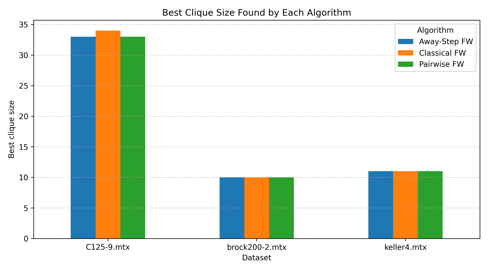
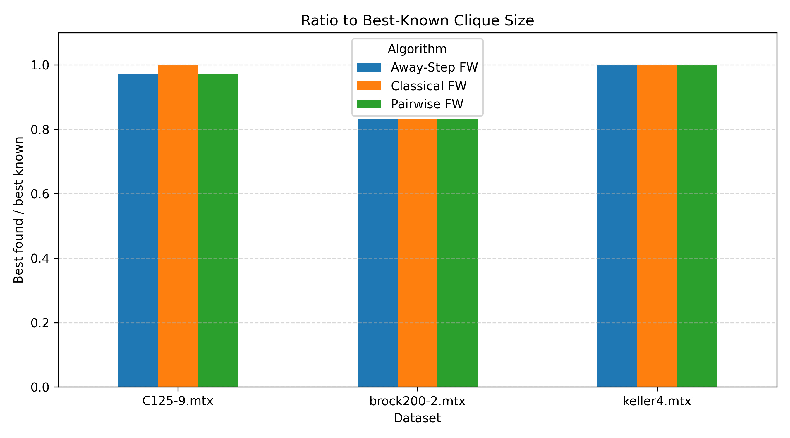
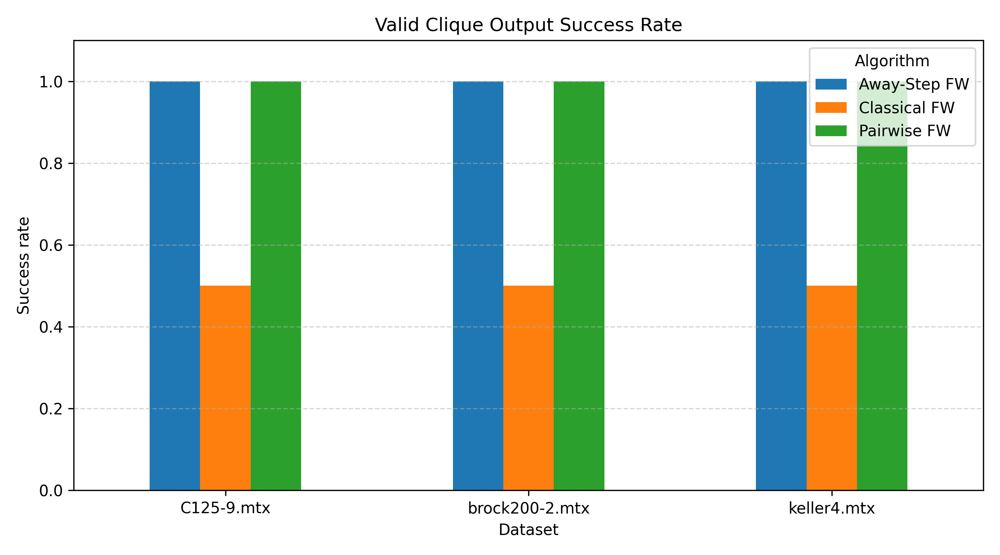

# ODS26_Group11_Clustering

Optimization Methods for Clustering project based on Frank-Wolfe variants for the L2-regularized maximum clique formulation on graph benchmark instances.

## Project Overview

This project studies projection-free optimization methods for solving a continuous formulation of the maximum clique problem over the probability simplex.

The objective is:

$$
\max_{x \in \Delta} F(x) = x^T A x + \frac{1}{2}\|x\|_2^2
$$

where $begin:math:text$A$end:math:text$ is the adjacency matrix of the graph and $begin:math:text$\\Delta$end:math:text$ is the probability simplex.

For implementation, the problem is written as the equivalent minimization problem:

$$
\min_{x \in \Delta} f(x) = -x^T A x - \frac{1}{2}\|x\|_2^2
$$

The final support of the solution is checked to verify whether it forms a valid clique.

## Implemented Algorithms

The project implements and compares three Frank-Wolfe variants:

- Classical Frank-Wolfe
- Away-Step Frank-Wolfe
- Pairwise Frank-Wolfe

All methods use:

- Linear minimization oracle over the simplex
- Exact line search
- Multiple starting points
- Final clique validation
- Comparison with known benchmark clique sizes

## Repository Structure

```text
code/
├── graph_loader.py
├── objective.py
├── lmo.py
├── line_search.py
├── utils.py
├── frank_wolfe.py
├── away_step_fw.py
├── pairwise_fw.py
├── plot_results.py
└── main.py

data/
├── C125-9.mtx
├── brock200-2.mtx
└── keller4.mtx

results/
└── results_summary.csv

plots/
├── best_clique_sizes.png
├── ratio_to_best_known.png
├── clique_success_rate.png
├── runtime_comparison.png
└── results_table.png

report/
```

## Files Description

- `graph_loader.py`: loads Matrix Market graph files and converts them into adjacency matrices.
- `objective.py`: defines the objective function, minimization form, gradient, and simplex utilities.
- `lmo.py`: contains the linear minimization oracles for the simplex and active set.
- `line_search.py`: implements exact line search for the quadratic objective.
- `utils.py`: contains shared helper functions for clique checking, clique density, and random starting points.
- `frank_wolfe.py`: implements Classical Frank-Wolfe.
- `away_step_fw.py`: implements Away-Step Frank-Wolfe.
- `pairwise_fw.py`: implements Pairwise Frank-Wolfe.
- `main.py`: runs all algorithms on all datasets and saves the comparison table.
- `plot_results.py`: generates plots from the saved results.

## How to Run

From the repository root, run:

```bash
python3 code/main.py
```

The script runs all algorithms on all datasets and saves the summary table in:

```text
results/results_summary.csv
```

To generate plots, run:

```bash
python3 code/plot_results.py
```

The plots are saved in:

```text
plots/
```

## Experimental Setup

The experiments use:

- 20 starting points
- Mixed initialization strategy
- Maximum iterations: 1000
- Frank-Wolfe gap tolerance: $begin:math:text$10\^\{\-6\}$end:math:text$
- Exact line search

The mixed initialization includes uniform, random vertex, and random simplex starting points.

## Results

| Dataset | Classical FW | Away-Step FW | Pairwise FW | Best Known |
|---|---:|---:|---:|---:|
| C125-9 | 26 | 30 | 33 | 34 |
| brock200-2 | 8 | 9 | 10 | 12 |
| keller4 | 9 | 11 | 11 | 11 |

Pairwise Frank-Wolfe achieved the best overall results in these experiments. Away-Step Frank-Wolfe improved over Classical Frank-Wolfe, while Classical Frank-Wolfe often produced dense supports and was less effective for clique extraction.

## Plots

### Best Clique Sizes



### Ratio to Best-Known Clique Size



### Valid Clique Output Success Rate



## Notes

The maximum clique formulation used here is non-convex. Therefore, the Frank-Wolfe gap is used as a stationarity measure, not as a certificate of global optimality.

The quality of each solution is evaluated by checking whether the final support forms a clique and by comparing the recovered clique size with known benchmark values.
